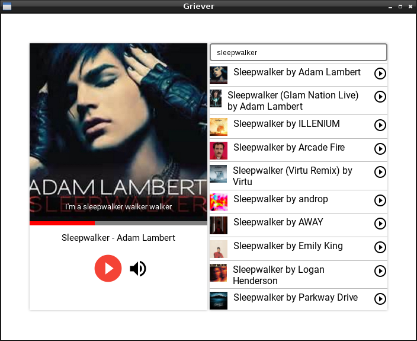

## Griever

Griever is a lightweight client for NetEase Music. 

Build upon:
- Electron
- Sequelize
- Sqlite3

### Disclaimer

- This web application only uses the local cached files and extracts the music meta data from the public web pages.
- There is no decryption or hacking in the source code to access some data or files with illegal intentions. 
- The copyrights of the music files and the music meta data belong to NetEase Cloud Music.
- There is no warranty about the quality and usability of the source code due to the potential changes in the NetEase Cloud Music client program or its official website.
- Last but not least, this is only a hobby project. Do not be too serious and just enjoy the music.  

### Current Version: 0.0.1
- [x] Search Music
- [x] Cache music and cover
- [x] Play Music after Search
- [x] Lyrics

### Next Version: 0.0.2
- [ ] Playlist
- [ ] Manage Cached files
- [ ] better UI

### ScreenShot

### License
Copyright 2018 kyicy

Permission is hereby granted, free of charge, to any person obtaining a copy of this software and associated documentation files (the "Software"), to deal in the Software without restriction, including without limitation the rights to use, copy, modify, merge, publish, distribute, sublicense, and/or sell copies of the Software, and to permit persons to whom the Software is furnished to do so, subject to the following conditions:

The above copyright notice and this permission notice shall be included in all copies or substantial portions of the Software.

THE SOFTWARE IS PROVIDED "AS IS", WITHOUT WARRANTY OF ANY KIND, EXPRESS OR IMPLIED, INCLUDING BUT NOT LIMITED TO THE WARRANTIES OF MERCHANTABILITY, FITNESS FOR A PARTICULAR PURPOSE AND NONINFRINGEMENT. IN NO EVENT SHALL THE AUTHORS OR COPYRIGHT HOLDERS BE LIABLE FOR ANY CLAIM, DAMAGES OR OTHER LIABILITY, WHETHER IN AN ACTION OF CONTRACT, TORT OR OTHERWISE, ARISING FROM, OUT OF OR IN CONNECTION WITH THE SOFTWARE OR THE USE OR OTHER DEALINGS IN THE SOFTWARE.
